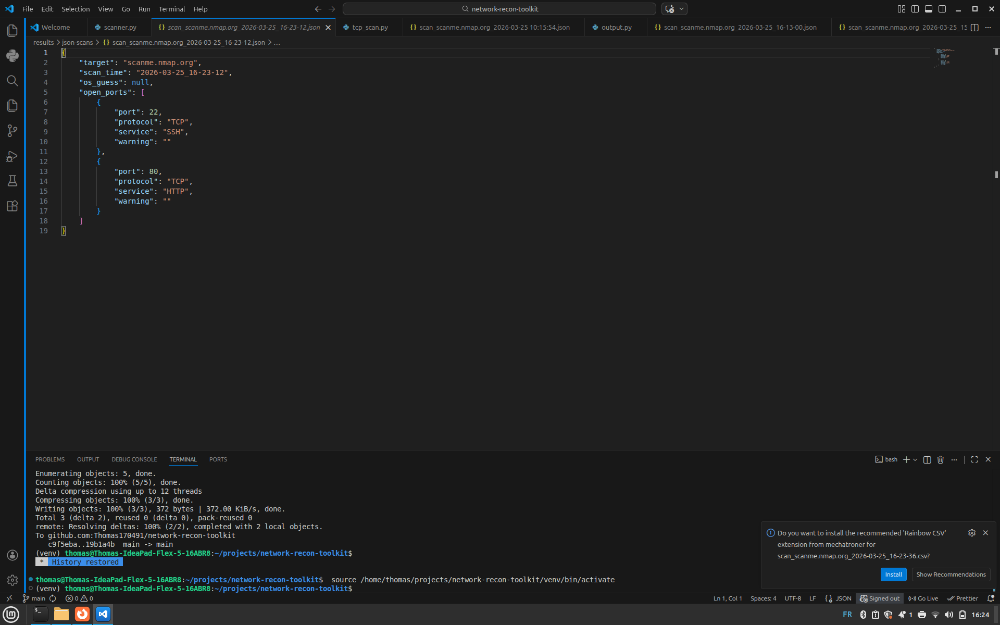
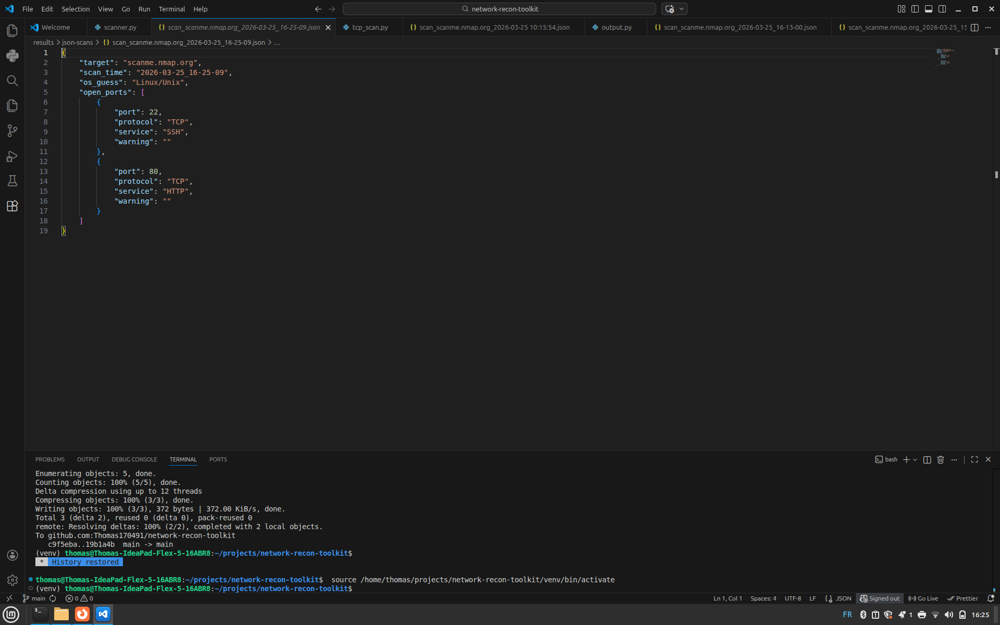
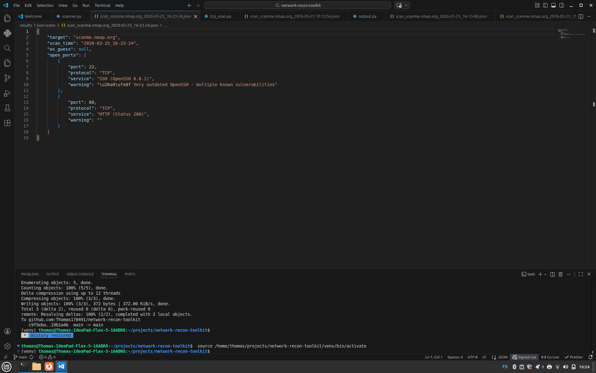
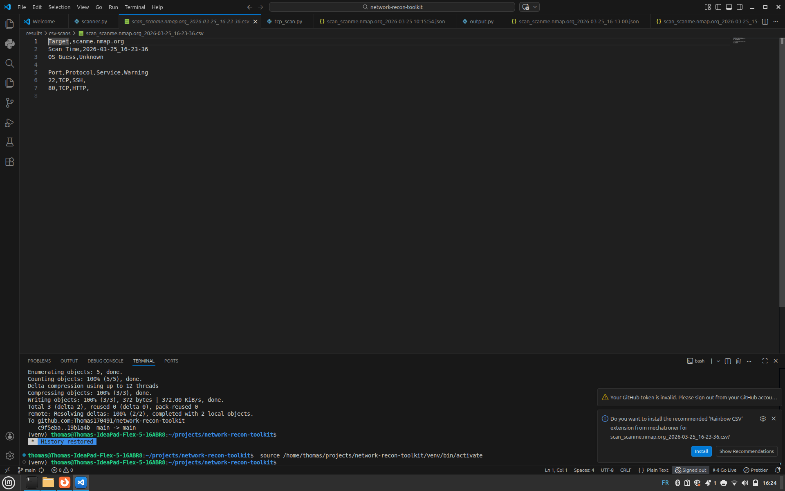

# 🔍 Network Recon Toolkit

A Python-based network reconnaissance toolkit inspired by Nmap.

The project performs TCP and UDP port scanning, banner grabbing, basic service and version detection, local vulnerability checks, TTL-based OS fingerprinting, and structured JSON/CSV reporting.

The vulnerability component uses a deliberately small local database for educational purposes. Specific CVE identifiers are reported only when the toolkit contains an explicit version-to-CVE mapping.

---

## 🚀 Features

- TCP connect port scanning
- UDP scanning with open / filtered detection
- Multithreaded scanning
- Configurable thread count and socket timeout
- Banner grabbing
- Service identification
- Basic software version extraction
- Local version-based vulnerability checks
- Structured CVE references for explicitly mapped vulnerabilities
- TTL-based OS estimation
- JSON export
- CSV export
- Command-line interface

---

## ⚙️ Installation

```bash
git clone https://github.com/Thomas170491/network-recon-toolkit.git
cd network-recon-toolkit

python3 -m venv .venv
source .venv/bin/activate

python -m pip install -r requirements.txt
```

On Windows:

```powershell
python -m venv .venv
.venv\Scripts\activate
python -m pip install -r requirements.txt
```

---

## 🧪 Usage

### Basic TCP scan

```bash
python scanner.py scanme.nmap.org 20-100
```

### Banner grabbing and service analysis

```bash
python scanner.py scanme.nmap.org 20-100 --banner
```

### UDP scan

```bash
python scanner.py scanme.nmap.org 20-100 --udp
```

### OS estimation

```bash
python scanner.py scanme.nmap.org 1-1000 --banner --os
```

### Custom performance settings

```bash
python scanner.py scanme.nmap.org 1-1000 \
    --threads 200 \
    --timeout 0.5
```

### JSON output

```bash
python scanner.py scanme.nmap.org 20-100 \
    --banner \
    --output json
```

### CSV output

```bash
python scanner.py scanme.nmap.org 20-100 \
    --banner \
    --output csv
```

---

## 🖥️ Example Output

Example terminal output may look like:

```text
[OPEN] TCP Port 22 -> SSH (OpenSSH 6.6.1) -> ⚠️ Very outdated OpenSSH - multiple known vulnerabilities
[OPEN] TCP Port 80 -> HTTP (Apache 2.4.49) -> ⚠️ Apache 2.4.49 vulnerable to path traversal -> CVEs: CVE-2021-41773

Detected OS: Linux/Unix
```

Actual results depend on the services and banners exposed by the target.

---

## 📁 Output Formats

### JSON

Results are exported as structured data:

```json
{
    "target": "example-host",
    "scan_time": "2026-09-01_15-30-00",
    "os_guess": "Linux/Unix",
    "open_ports": [
        {
            "port": 80,
            "protocol": "TCP",
            "service": "HTTP (Apache 2.4.49)",
            "warning": "⚠️ Apache 2.4.49 vulnerable to path traversal",
            "cves": [
                "CVE-2021-41773"
            ]
        },
        {
            "port": 22,
            "protocol": "TCP",
            "service": "SSH (OpenSSH 9.3)",
            "warning": "",
            "cves": []
        }
    ]
}
```

### CSV

```csv
Port,Protocol,Service,Warning,CVEs
80,TCP,HTTP (Apache 2.4.49),⚠️ Apache 2.4.49 vulnerable to path traversal,CVE-2021-41773
22,TCP,SSH (OpenSSH 9.3),,
```

---

## 🧠 How It Works

### TCP Scanning

The toolkit uses Python sockets and `connect_ex()` to determine whether TCP ports accept connections.

Port ranges are processed concurrently using `ThreadPoolExecutor`.

### UDP Scanning

UDP probes are sent to selected ports.

UDP results must be interpreted carefully because the absence of a response can mean either:

```text
Open
or
Open | Filtered
```

UDP scanning is therefore inherently less deterministic than TCP connect scanning.

### Banner Grabbing

For open TCP ports, the scanner can request available service information and capture returned banner data.

HTTP responses are preserved sufficiently to inspect headers such as:

```text
Server: Apache/2.4.49
```

### Service Detection

The service parser first attempts to identify a service from banner content.

If no useful banner information is available, the toolkit falls back to a local mapping of commonly used ports.

### Version Detection

Regular expressions extract software versions from supported service banners.

For example:

```text
SSH-2.0-OpenSSH_9.3
```

can be normalized to:

```text
SSH (OpenSSH 9.3)
```

An HTTP response containing:

```text
Server: Apache/2.4.49
```

can be normalized to:

```text
HTTP (Apache 2.4.49)
```

### Vulnerability Checks

Detected software and versions are compared against a small local vulnerability database.

The database supports two types of findings:

**General version warnings**

Example:

```text
Very outdated OpenSSH - multiple known vulnerabilities
```

These warnings do not automatically receive CVE identifiers.

**Explicit CVE mappings**

When the toolkit contains a specific mapping between a software version and a vulnerability, the CVE is returned as structured data.

For example:

```text
Apache 2.4.49
    ↓
CVE-2021-41773
```

The scanner intentionally does not invent CVE associations for versions that only trigger a general outdated-software warning.

---

## 🧪 Automated Tests

The project includes automated tests for:

- service parsing
- SSH version extraction
- HTTP status parsing
- HTTP server/version extraction
- fallback port identification
- version normalization
- vulnerability warnings
- structured vulnerability results
- CVE mapping
- prevention of incorrect CVE assignment
- end-to-end Apache banner-to-CVE detection

Run the test suite with:

```bash
python -m pytest -v
```

Current test suite:

```text
16 passed
```

---

## ⚠️ Limitations

This project is an educational network reconnaissance toolkit, not a replacement for Nmap or a production vulnerability scanner.

Current limitations include:

- UDP open/open-filtered ambiguity
- heuristic TTL-based OS detection
- limited service fingerprinting
- limited banner parsing
- small local vulnerability database
- no live NVD or vendor-advisory integration
- CVE coverage limited to explicitly configured mappings
- version detection depends on services exposing useful banner information

A missing vulnerability warning does **not** mean that a service is secure.

---

## 🔮 Future Improvements

Potential future improvements include:

- NVD or Vulners API integration
- richer service fingerprinting
- additional banner parsers
- improved UDP service detection
- CVSS severity information
- vulnerability references and remediation guidance
- expanded automated test coverage
- improved terminal formatting

---

## ⚖️ Legal and Security Disclaimer

This project is provided for **educational purposes, cybersecurity training, and authorized security testing only**.

Only scan systems, networks, or services that you own or for which you have received explicit permission to test. Unauthorized network scanning or security testing may violate applicable laws, regulations, organizational policies, or terms of service.

The vulnerability detection functionality in this toolkit is intentionally simplified. It relies on a small local database and basic service/version matching and therefore:

- does not provide complete vulnerability coverage
- may produce false positives or false negatives
- does not replace professional vulnerability scanners
- does not replace vendor security advisories or authoritative sources such as NVD
- should not be used as the sole basis for security or remediation decisions

A reported CVE indicates that the detected software/version matched an explicitly configured rule in the toolkit. It does **not** by itself confirm that the target system is exploitable.

Likewise, the absence of a vulnerability warning does **not** mean that a system or service is secure.

Users are responsible for ensuring that their use of this software is lawful, authorized, and appropriate for their environment.

The author assumes no responsibility for misuse, unauthorized activity, damage, data loss, service disruption, or other consequences resulting from the use of this project.

---

## 📸 Screenshots

### Terminal Scan Output


### JSON Output



### OS Detection



### Banner Grabbing



### CSV Export



---

## 📌 Author

**Thomas Papas**

GitHub: https://github.com/Thomas170491  
LinkedIn: https://www.linkedin.com/in/thomas-papas-06aa35167/

---

## ⭐ Acknowledgements

Inspired by Nmap and standard network reconnaissance techniques.