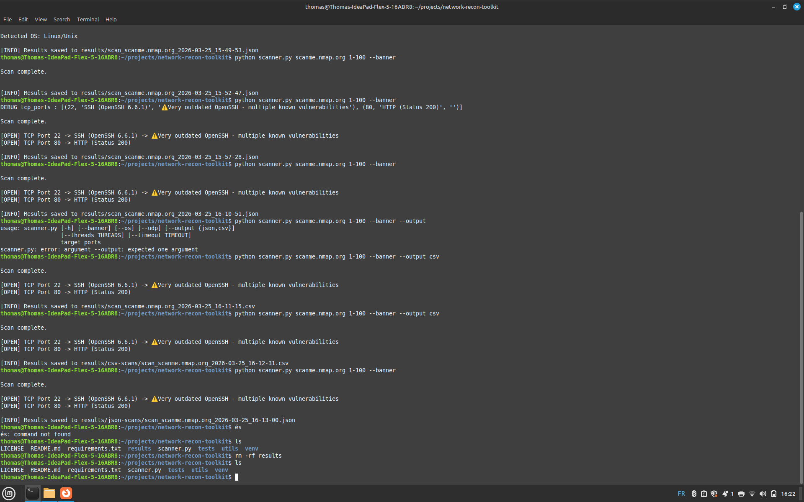

# 🔍 Network Recon Toolkit

A Python-based network reconnaissance tool inspired by Nmap.  
It performs TCP and UDP port scanning, service detection, version parsing, vulnerability detection with CVE references, OS fingerprinting, and exports results in JSON or CSV format.

---

## 🚀 Features

- ✅ TCP Connect Port Scanning
- ✅ UDP Port Scanning (open / filtered detection)
- ✅ Banner Grabbing
- ✅ Service Detection (banner + port fallback)
- ✅ Version Extraction
- ✅ Vulnerability Detection with CVE references
- ✅ OS Detection (TTL-based)
- ✅ Multithreaded Scanning
- ✅ JSON & CSV Export
- ✅ CLI Interface with configurable options

---

## ⚙️ Installation

bash
git clone https://github.com/Thomas170491/network-recon-toolkit.git
cd network-recon-toolkit

# (optional but recommended)
python -m venv venv
source venv/bin/activate   # Linux / Mac
venv\Scripts\activate      # Windows

## 🧪 Usage

### Basic TCP scan
 
```bash
python scanner.py scanme.nmap.org 20-100
```

### With banner grabbing

```bash
python scanner.py scanme.nmap.org 20-100 --banner
```

### Full scan (recommended)

```bash
python scanner.py scanme.nmap.org 1-1000 --banner  --os
```
### Custom performance settings

```bash
python scanner.py scanme.nmap.org 1-1000 --threads 200 --timeout 0.5
```   

### Export results

```bash
# JSON (default)
python scanner.py scanme.nmap.org 20-100 --output json 


# CSV
python scanner.py scanme.nmap.org 20-100 --output csv
```

## 🖥️ Example Output

```bash
[OPEN] TCP Port 22 -> SSH (OpenSSH 6.6.1) -> ⚠️ Very outdated OpenSSH
[OPEN] TCP Port 80 -> HTTP (Status 200)
[OPEN] UDP Port 53

Detected OS: Linux/Unix
```

## 📁 Output Formats

### JSON

```json
{
  "target": "scanme.nmap.org",
  "scan_time": "2026-03-25_14-32-10",
  "os_guess": "Linux/Unix",
  "open_ports": [
    {
      "port": 22,
      "protocol": "TCP",
      "service": "SSH (OpenSSH 6.6.1)",
      "warning": "⚠️ Very outdated OpenSSH",
      "cves": ["CVE-2016-0777"]
    },
    {
      "port": 80,
      "protocol": "TCP",
      "service": "HTTP (Status 200)",
      "warning": null
    }
  ]
}

```

### CSV

```csv

Port,Protocol,Service,Warning
22,TCP,SSH (OpenSSH 6.6.1),⚠️ Very outdated OpenSSH
80,TCP,HTTP (Status 200),
53,UDP,Unknown,

```

## 🧠 How It Works

### TCP Scan
Uses socket.connect_ex() to determine if a port is open.

### UDP Scan
Sends UDP packets to target ports
Interprets responses:
Response → Open
ICMP Port Unreachable → Closed
No response → Open | Filtered

### Banner Grabbing
Attempts to extract service information by sending minimal requests (e.g., HTTP HEAD).
Service Detection
Matches known keywords in banners
Falls back to known port-service mappings

### Version Detection
Uses regex to extract software versions from banners.
Vulnerability Detection
Matches detected services/versions against a local vulnerability database
Includes CVE references for known issues

### OS Detection
Estimates OS based on TTL values from ping responses.

## ⚠️ Limitations
UDP scanning is inherently unreliable (open vs open|filtered ambiguity)
OS detection is heuristic-based (TTL approximation)
Vulnerability detection uses a simplified local database (not exhaustive)

## ⚖️ Legal Disclaimer
This tool is intended for educational purposes and authorized security testing only.
Do NOT scan systems without explicit permission.
The author is not responsible for any misuse or illegal activity.

## 📸 Screenshots

 
### Terminal scan output



### JSON result files


### CSV export


## 🛠️ Future Improvements

Advanced service fingerprinting
API-based CVE integration (NVD / Vulners)
Improved UDP service detection
Output formatting enhancements (colors, tables)

## 📌 Author
Thomas Papas
GitHub: https://github.com/Thomas170491⁠�
linkedIn : https://www.linkedin.com/in/thomas-papas-06aa35167/

## ⭐ Acknowledgements
Inspired by tools like Nmap and standard network reconnaissance techniques.